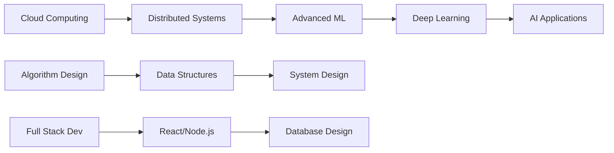

# Hi there, I'm Sagar Lekhraj! 👋

<div align="center">
  
</div>

<p align="center">
  <a href="https://www.linkedin.com/in/sagar-lekhraj-1351222b2/"></a>
  <a href="https://www.upwork.com/freelancers/~yourprofile"></a>
  <a href="https://www.fiverr.com/yourusername"></a>
  <a href="https://www.behance.net/sagarlekhraj"></a>
</p>

---
##https://www.canva.com/design/DAG6WJsXqCE/5s4L5eD4KT9rLG_-Rj11cQ/edit?utm_content=DAG6WJsXqCE&utm_campaign=designshare&utm_medium=link2&utm_source=sharebutton
## 🚀 About Me

```python
class SagarLekhraj:
    def __init__(self):
        self.name = "Sagar Lekhraj"
        self.role = "CS Student & ML Enthusiast"
        self.education = "IBA Karachi (BS Computer Science)"
        self.gpa = 3.4
        self.location = "Karachi, Pakistan"
        self.interests = ["Machine Learning", "Game Development", 
                         "Graphic Design", "Web Development"]
        
    def current_focus(self):
        return [
            "Building ML models with Scikit-learn & PyTorch",
            "Developing full-stack web applications",
            "Creating engaging visual content",
            "Contributing to open-source projects"
        ]
    
    def say_hi(self):
        print("Thanks for dropping by! Let's build something amazing together!")

me = SagarLekhraj()
me.say_hi()
```

🎓 **CS Junior at IBA Karachi** | GPA: 3.4/4.0  
💼 **Freelance Graphic Designer** | 35+ projects completed  
🤖 **Machine Learning Practitioner** | Building intelligent solutions  
🎮 **Game Developer** | Created physics-based 2D games  
📚 **Math Tutor** | Helped 50+ students ace their entrance exams  

---

## 💻 Tech Stack

### Programming Languages


### Machine Learning & Data Science


### Design Tools


### Tools & Technologies


---

## 📊 GitHub Statistics

<p align="center">
  
  
</p>

<p align="center">
  
</p>

---

## 🏆 Highlights & Achievements

- 🎨 **50+ Design Projects** completed on Upwork & Fiverr with 5-star ratings
- 🤖 **Machine Learning Projects** using PyTorch, Scikit-learn, and TensorFlow
- 🎮 **Game Development** - Built 2D physics-based game using C++ & Allegro 5
- 📈 **20% Engagement Boost** - Increased customer engagement through strategic visual content
- 👨‍🏫 **30% Performance Improvement** - Helped 50+ students improve their math scores
- 🏅 **Multiple Certifications** in Digital Marketing, Freelancing, and Soft Skills
- 🌱 **Active Volunteer** in IBA societies (Go Green, Film, Math & Astronomy, Arts & Photography)

---

## 🔥 Featured Projects

### 🎮 Maze Control Game
> **2D Physics-Based Game using C++ & Allegro 5**
- Integrated realistic motion, gravity, and collision detection
- Applied real-world physics concepts to simulate engaging gameplay
- Demonstrated strong understanding of game development fundamentals

### 🤖 Machine Learning Models
> **Intelligent Solutions with Scikit-learn & PyTorch**
- Built predictive models for data analysis and classification
- Implemented neural networks using PyTorch
- Data visualization and analysis using Pandas, NumPy, and Matplotlib

### 🎯 Scrabble Game AI Winner Detector
> **AI-powered game analysis tool**
- Developed intelligent system to detect and analyze Scrabble game winners
- Utilized advanced algorithms and data structures

### 🎨 Freelance Design Portfolio
> **35+ Client Projects on Upwork, Fiverr & Behance**
- Created engaging infographics, social media posts, and brand identities
- Achieved 100% order completion rate with 5-star reviews
- Specialized in creating visuals that tell compelling stories

---

## 📚 Current Learning Journey



**Currently Exploring:**
- ☁️ Cloud Computing & Distributed Database Systems
- 🧠 Deep Learning with PyTorch & TensorFlow
- 🎯 Advanced Algorithm Design & Optimization
- 🌐 Full-Stack Web Development
- 🎨 UI/UX Design Principles

---

## 💼 Professional Experience

### 🏢 IBA Karachi - Accreditation Lead (Aug 2024 - Nov 2024)
- Designed 20+ high-impact infographics and templates
- Managed 1000+ data entries improving documentation accuracy
- Coordinated with 10+ departments for seamless communication

### 🛒 Campus Bazaar - Graphic Designer (Mar 2024 - Apr 2024)
- Created 50+ product visuals enhancing online appeal
- Contributed to 20% boost in customer engagement

### 🎨 iHunar - Graphic Designer (Apr 2023 - Jun 2023)
- Designed 40+ marketing materials
- Boosted online engagement by 25%

---

## 🎯 What I'm Looking For

- 🤝 Open-source collaboration opportunities
- 💡 Innovative ML/AI projects
- 🚀 Internship opportunities in Software Development
- 🎨 Freelance design and development projects
- 📚 Research opportunities in Computer Science

---

## 📫 Let's Connect!

<p align="center">
  <a href="mailto:your.email@example.com">
    
  </a>
  <a href="https://www.linkedin.com/in/sagar-lekhraj-1351222b2/">
    
  </a>
  <a href="https://github.com/Sagarlekhraj-19">
    
  </a>
</p>

<p align="center">
  
</p>

---

<p align="center">
  
</p>

<p align="center">
  💙 <b>Open to collaborations and opportunities!</b> 💙
</p>
